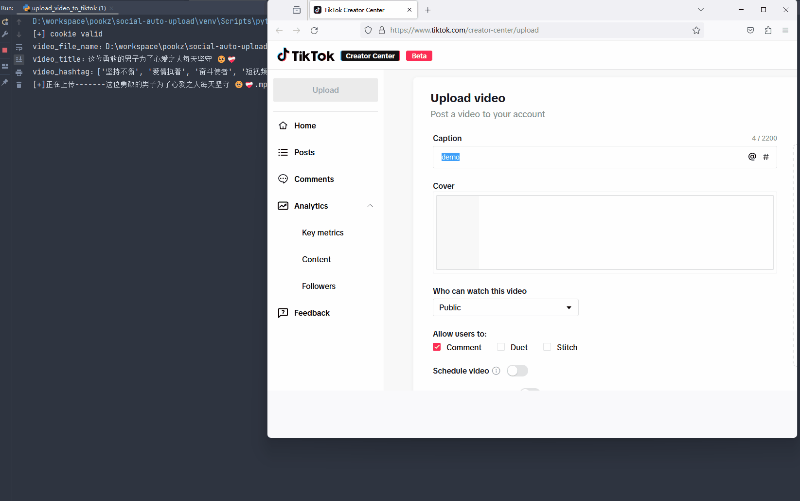
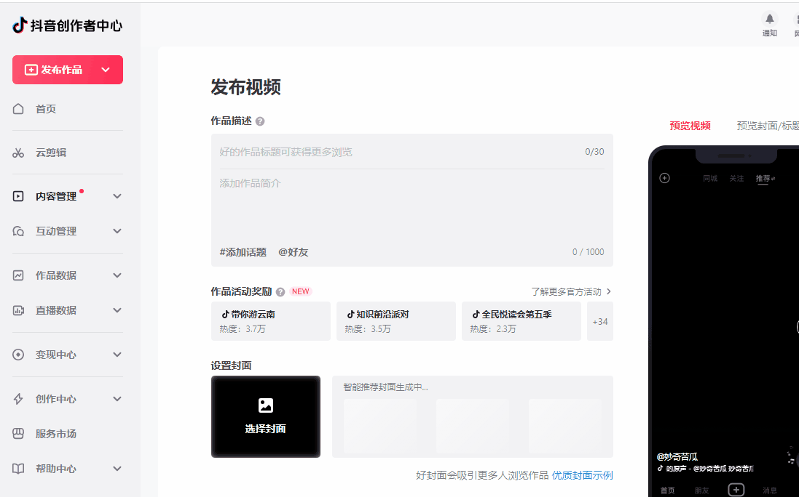
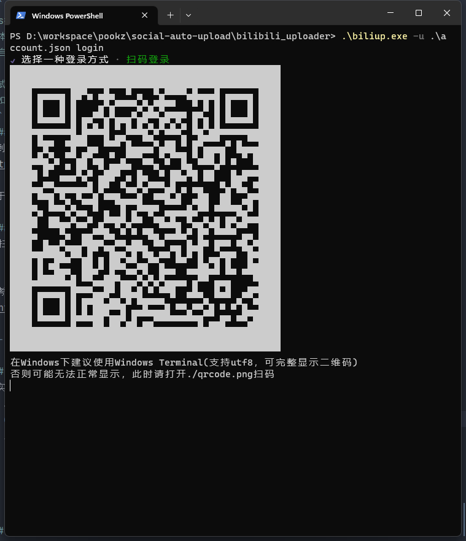
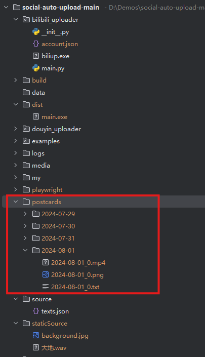
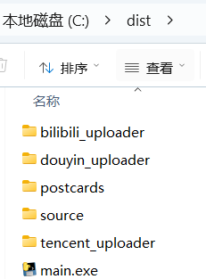

# GenerateAndAutoupload
项目来源：https://github.com/dreammis/social-auto-upload
## 启动必知道
conf.py  这里配置了chrome浏览器的启动位置，你的项目一定要安装chrome C:\Program Files\Google\Chrome\Application\chrome.exe
## 项目图片示例


该项目在上面的项目基础上增加和删除了一些功能旨在自动生成视频并发布视频到各个社交媒体平台并打包程序


## how to use
默认当天的日期，网上找到的素材按照黏贴到空白处点击保存按钮，然后点击生成选定日期视频，再点击一键上传即可。

## 💡Feature
- 中国主流社交媒体平台：
  - [x] 抖音
  - [x] 视频号
  - [x] bilibili



# 💾Installation
```
pip install -r requirements.txt
playwright install chromium firefox
```
非程序员，[新手级教程](https://juejin.cn/post/7372114027840208911)

# 🐇 About
The project for my own project extracted, my release strategy is timed release (released a day in advance), so the release part of the event are used for the next day time!

If you need to release it immediately, you can study the source code or ask me questions.


如果你有需求立即发布，可自行研究源码或者向我提问


# 核心模块解释

### 1. 视频文件准备(video prepare)
filepath 本地视频目录，目录包含(filepath Local video directory containing)

- 视频文件(video files)
- 视频meta信息txt文件(video meta information txt file)

举例(for example)：

file：2023-08-24_16-29-52 - 这位勇敢的男子为了心爱之人每天坚守 .mp4

meta_file:2023-08-24_16-29-52 - 这位勇敢的男子为了心爱之人每天坚守 .txt

meta_file 内容(content)：
```angular2html
这位勇敢的男子为了心爱之人每天坚守 🥺❤️‍🩹
#坚持不懈 #爱情执着 #奋斗使者 #短视频
```

### Usage
1. 设置conf 文件中的 `LOCAL_CHROME_PATH`(在douyin、视频号 tiktok可能出现chromium 不兼容的各种问题，建议设置本地的chrome)
2. 这里分割出来3条路
   - 可自行研究源码，免费、任意 穿插在自己的项目中
   - 可参考下面的各个平台的使用指南，`examples`文件夹中有各种示例代码
   - 使用cli 简易使用(支持tiktok douyin 视频号)

#### cli 用法
```python 
python cli_main.py <platform> <account_name> <action: upload, login> [options]
```
查看详细的参数说明使用：
```python
python cli_main.py -h
```
```python
usage: cli_main.py [-h] platform account_name action ...

Upload video to multiple social-media.

positional arguments:
  platform      Choose social-media platform: douyin tencent tiktok
  account_name  Account name for the platform: xiaoA
  action        Choose action
    upload      upload operation
    login       login operation
    watch       watch operation

options:
  -h, --help    show this help message and exit

```
示例
```python
python cli_main.py douyin test login
douyin平台，账号名为test，动作为login

python cli_main.py douyin test upload "C:\Users\duperdog\Videos\2023-11-07_05-27-44 - 这位少女如梦中仙... .mp4" -pt 0
douyin平台, 账号名为test, 动作为upload, 视频文件（需对应的meta文件，详见上）, 发布方式（pt）：0 立即发布

python cli_main.py douyin test upload "C:\Users\superdog\Videos\2023-11-07_05-27-44 - 这位少女如梦中仙... .mp4" -pt 1 -t "2024-6-14 12:00"
douyin平台, 账号名为test, 动作为upload, 视频文件, 发布方式（pt）：1 定时发布, 发布时间(t)： 2024-6-14 12:00
```

---

## 各平台详细说明

### 1. 抖音


使用playwright模拟浏览器行为
> 抖音前端实现，诸多css class id 均为随机数，故项目中locator多采用相对定位，而非固定定位
1. 准备视频目录结构
2. cookie获取：get_douyin_cookie.py 扫码登录
3. 上传视频：upload_video_to_douyin.py 


其他部分解释：
```
douyin_setup handle 参数为True，为手动获取cookie False 则是校验cookie有效性

generate_schedule_time_next_day 默认从第二天开始（此举为避免选择时间的意外错误）
参数解释：
- total_videos 本次上传视频个数(我调整了上限为10)
- videos_per_day 每日上传视频数量(我调整了上限为10)
- daily_times 视频发布时间 默认10、11、12、13、14、15、16、17、18、19点
- start_days 从第N天开始
```

> 2023年12月15日补充：使用chromium可能会出现无法识别视频封面图片的情况
> 解决方案：
> 1. 下载chrome
> 2. 找到chrome的安装目录
> 3. 将本地chrome 路径conf文件中 LOCAL_CHROME_PATH = "xxx/xxx/chrome.exe"


参考项目：
- https://github.com/wanghaisheng/tiktoka-studio-uploader
- https://github.com/Superheroff/douyin_uplod
- https://github.com/lishang520/DouYin-Auto-Upload.git

---

### 2. 视频号
使用playwright模拟浏览器行为
1. 准备视频目录结构
2. cookie获取：get_tencent_cookie.py 扫码登录
3. 上传视频：upload_video_to_tencent.py 


其他部分解释：
```
参考上面douyin_setup 配置
```

> 视频号使用chromium会出现不支持上传视频，需要自行指定本地浏览器
> 解决方案：
> 1. 下载chrome
> 2. 找到chrome的安装目录
> 3. 将本地chrome 路径conf文件中 LOCAL_CHROME_PATH = "xxx/xxx/chrome.exe"

---


### 3. bilibili
该实现，借助biliup的[biliup-rs](https://github.com/biliup/biliup-rs)，再次感谢。
1. 准备视频目录结构
2. cookie获取：`biliup.exe -u account.json login` 选项你喜欢的登录方式
 
3. 上传视频：upload_video_to_bilibili.py

#### 解释与注意事项：

```
bilibili cookie 长期有效（至少我运行2年以来是这样的）
其他平台 诸如linux mac 服务器运行 请自行研究
```
参考项目：
- https://github.com/biliup/biliup-rs

---
## 打包项目成exe应用
```
打包前你的项目结构
```


```
修改main.spec,其中pathex是你项目放的位置，我的项目放到了D:\Demos\social-auto-upload-main
```

---

```
点击生成exe.bat，项目打包后的成品大概这个样子
```




参考项目：
- https://github.com/wkaisertexas/tiktok-uploader

---

### 其余部分(todo)
整理后上传

---


## ffmpeg生成文字转视频
ffmpeg安装教程https://www.cnblogs.com/wwwwariana/p/18191233
